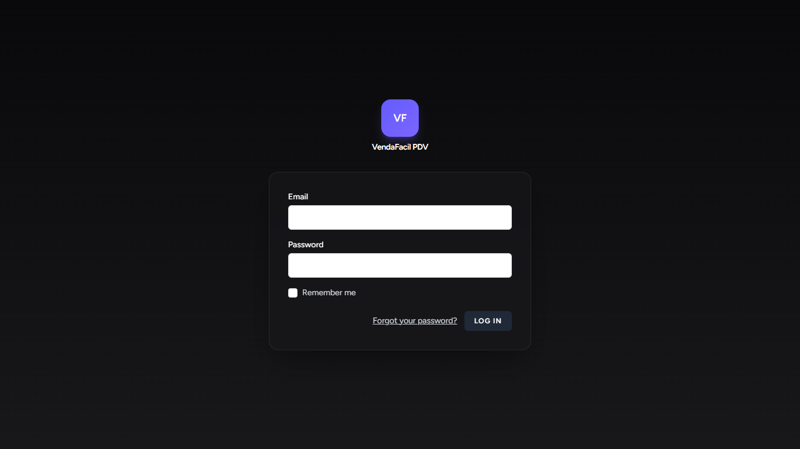
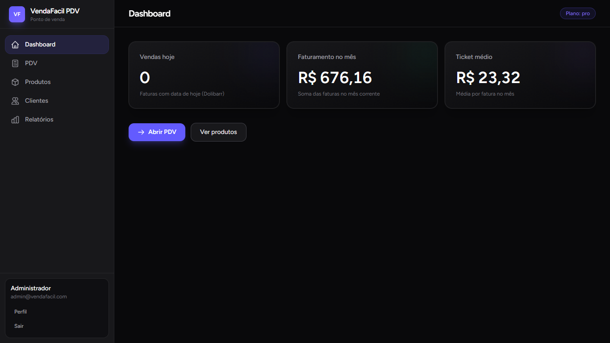
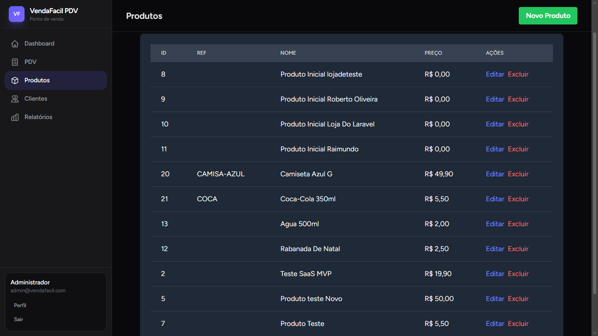

# VendaFacil PDV

Sistema PDV multi-loja integrado com Dolibarr ERP. Desenvolvido para lojistas que precisam de controle de estoque e vendas com sincronização em tempo real.

**Stack:** Laravel 11 + Breeze + TailwindCSS + MySQL + Dolibarr API

### **Demonstração**

| Login | Dashboard |
| --- | --- |
| | |

| Listagem Produtos | Edição Produto |
| --- | --- |
| | |

> Pra adicionar os prints: cria pasta `public/img/` e salva as imagens lá com os nomes `login.png`, `dashboard.png`, etc.

### **Features**

- **Multi-tenancy** - Cada loja acessa só seus próprios produtos
- **Integração Dolibarr** - CRUD de produtos sincroniza direto com ERP via API
- **Controle de acesso** - SuperAdmin vs Usuário Loja
- **Autenticação** - Laravel Breeze com roles
- **Dark/Light mode** - Suporte automático baseado no sistema
- **Referência customizada** - Cada loja tem seu código interno por produto

### **Rodando Local**

1. **Clonar e instalar dependências**
```bash
git clone https://github.com/SEU_USUARIO/vendafacil-pdv.git
cd vendafacil-pdv
composer install
npm install